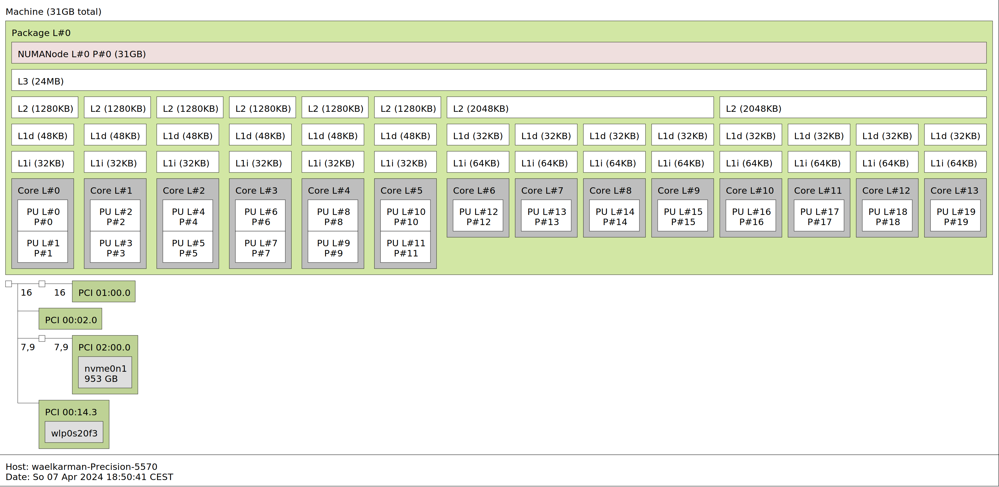

# parallel programming [in development]
The main goal is to master parallel programming using C++ primitives, POSIX Threads and OpenMPI.

- C++/17 primitives
- POSIX Threads
- OpenMPI

Test carried on: 
-   lstopo
-   numactl

