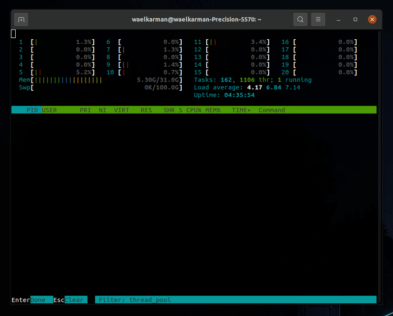

# parallel programming [in development]
The main goal is to master parallel programming using C++ primitives, POSIX Threads and OpenMPI.

- C++/20 primitives
- POSIX Threads
- OpenMPI

The gif shows the behaviour implemented into the singlecore_scheduler file as can be seen into htop observing the PID the application is loading creating a thread for each core sequentially. 

The gif shows the behaviour implemented into the thread_pool file as can be seen into htop the thread PID are always the same to process 100 different tasks.

<!-- lstopo --> 
<!-- numactl -->

# C++/20 build within a Docker
Use the dockerfile to compile the C++/20 code if your system does not support it.

Please build using the following commands:

> sudo docker build -t cpp20-runner .

To run:

> sudo docker run cpp20-runner ./\<EXECUTABLE NAME\>

To stop the execution find the ID of your container using:

> sudo docker ps

To stop:

> sudo docker stop \<CONTAINER ID\>

